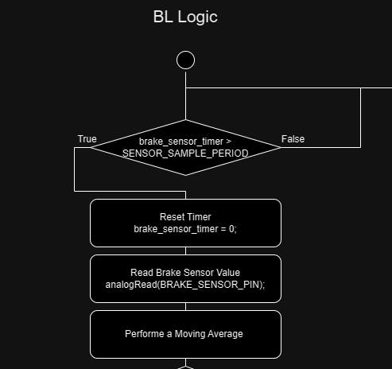

# Recruits Task - Week #2
- ## [git para noobs](https://hackmd.io/@PedroRomao/HJ0GJSae1x)
- ## Add this file to your local git repository create a new branch and work on it, when you are done or as you complete the questions merge the branch into the main branch (remote main branch will have your final work, this means main branch on GitHub, please make the repository public for the next weeks).
- ## Perform the following tasks to the best of your hability, sometimes, in the questions, there are multiple answers just tell us what you think, feel free to use the group to ask questions.

### 1
**1.** Check out the [el-sw repository](https://github.com/fs-feup/el-sw/tree/main) code and documentation  and try to generally understand what the software does in each device (there is no need to understand all the little details).
### 2
When we read values from the brake sensor (C1) and the apps (C3) we do not use the most recent reading and use instead a different approach. Explain the approach and why you think it is used.

**Answer:** 
When reading the values from the brake sensor and the APPS, the program performs what is referred in the Brake Light Diagram as "Moving Average".



This approach, instead of using the value that is read by the sensors in that moment, it uses the average of a sample (of which size is expressed by the macro AVR_SAMPLE).
This sample is created using the FIFO principle (a queue). It stores the last (AVR_SAMPLES - 1) samples, adds the value read by the sensor and performs the average. 
This, I believe, is used to attenuate the occurrence of "spikes" in the data, moments where the value of the sensor could be somewhat wrong. With this, we make sure that there is some corroboration in the data set.
Here we have the code snippets that read the brake sensor and the APPS respectively, where we can see the code reading from the sensors, inserting it to the buffer that holds the rest of the dataset and finally performing the average.


**Brake Sensor**
```c++
        #define SENSOR_SAMPLE_PERIOD 20    // ms
        #define AVG_SAMPLES 20

        ...

        brake_sensor_timer = 0;
        brake_val = analogRead(BRAKE_SENSOR_PIN);
        bufferInsert(avgBuffer1, AVG_SAMPLES, brake_val);
        brake_val = average(avgBuffer1, AVG_SAMPLES);

```

**APPS**
```c++
        #define APPS_READ_PERIOD_MS 20      // ms
        #define AVG_SAMPLES 5

        ...

        int v_apps1 = analogRead(APPS_1_PIN);
        int v_apps2 = analogRead(APPS_2_PIN);

        bufferInsert(avgBuffer1, AVG_SAMPLES, v_apps1);
        bufferInsert(avgBuffer2, AVG_SAMPLES, v_apps2);

        v_apps1 = average(avgBuffer1, AVG_SAMPLES);
        v_apps2 = average(avgBuffer2, AVG_SAMPLES);
        sendAPPS(v_apps1,v_apps2);
```
**Dúvidas se incluo ou não**

*However, with this approach, you might loose some of the rate of change of what is actually happening with the car. So, there is some tradeoffs to be made with this. So, although both software has the same sample period for the same AVG_SAMPLES, the APPS is more prone to fast*

*//fazer a ligação entre isto e o resto da resposta / pergunta
Moreover, I believe the difference in the AVG_SAMPLES is due to a compromised being made, in which, although you want that average, you also want it to be freaking FAST BABY (being aware that the sample period in both is the same)*


### 3
Check out the R2D(Ready To Drive) code on the C3 state machine. In the condition below we use a timer (R2DTimer) to check the brake was engaged instead of just checking the brake pressure received from can, why?
```c++
        if ((r2dButton.fell() and TSOn and R2DTimer < R2D_TIMEOUT) or R2DOverride)
        {
            playR2DSound();
            initBamocarD3();
            request_dataLOG_messages();
            R2DStatus = DRIVING;
            break;
        }
```

**Answer:**
In the if statement above, in order to switch the *R2DStatus* to *DRIVING*, not only has the TS to be on, but the *r2dButton* has to be pressed at the same time as the brakes. For the brakes to "count" as pressed, the value read has to be grater than 165 and regarding the button, the method *fell()* returns if the button signal has gone from LOW to HIGH since the last call of the method *update()*.
This may originate a problem since this can be a little time sensitive in the sense that the brakes were pressed but when you take your hand off the button, the brake pressure may be now below that threshold. So, in order to remove this "bad timing", the *R2DTimer* along with its *R2D_TIMEOUT* has been implemented. Now, whenever the brake is pressed passed that threshold, the timer (which is an object from the *ElapsedMillis* class) is set to 0, now giving the driver R2D_TIMEOUT milliseconds to press the *r2dButton*.

**Resetting the R2DTimer**
```c++

        void canSniffer(const CAN_message_t& msg) {
            switch (msg.id) {
                ...
                case C3_ID:
                    brakeValue = (msg.buf[2] << 8) | msg.buf[1];
                    if (brakeValue > 165)
                        R2DTimer = 0;
                    break;
                ...
            }
        }
```


**In the documentation of Bounce2**
*bool fell()	Returns true if pin signal transitions from high to low since the last update.*

*Quando é que o timer do Brake começa?*
*R2DOverride é pra testes?*


### 4
What is the ID of the can message sent to the bamocar to request torque?
**Answer:**
According to the *CAN Table*, which is present in the Team's Google Drive, we can see a row with the following comment "Torque Request to Bamocar". Therefor, the ID of the CAN message sent to the bamocar to request torque is 0x201.

### 5 
The code below is not amazing, tell us some things you would change to improve it, you can write them down in text or correct the code:
```c++
// this is a class for my car
class mycar {
private:
    int sensor_reading1; // hydraulic pressure sensor
    int sensor_reading2; // temperature sensor
    int sensor_reading3; // humidity sensor
    int sensor_reading4; // light sensor
    int sensor_reading5; // sound sensor
    int sensor_reading6; // distance sensor
    int sensor_reading7; // accelerometer sensor
    int sensor_reading8; // gyroscope sensor

    int sensor_reading9; // old sensor, not used anymore

public:
    mycar() : sensor_reading1(0), sensor_reading2(0), sensor_reading3(0), sensor_reading4(0),
            sensor_reading5(0), sensor_reading6(0), sensor_reading7(0), sensor_reading8(0) {}

    // Method will update readings by analog reading and print them 
    void updateprint() {
        sensor_reading1 = analogRead(0); // pin 0 is connected to the hydraulic pressure sensor
        sensor_reading2 = analogRead(1); // pin 1 is connected to the temperature sensor
        sensor_reading3 = analogRead(2); // pin 2 is connected to the humidity sensor
        sensor_reading4 = analogRead(3); // pin 3 is connected to the light sensor
        sensor_reading5 = analogRead(4); // pin 4 is connected to the sound sensor
        sensor_reading6 = analogRead(5); // pin 5 is connected to the distance sensor
        sensor_reading7 = analogRead(6); // pin 6 is connected to the accelerometer sensor
        sensor_reading8 = analogRead(7); // pin 7 is connected to the gyroscope sensor
        func(sensor_reading1, sensor_reading2, sensor_reading3, sensor_reading4, 
              sensor_reading5, sensor_reading6, sensor_reading7, sensor_reading8);// print the readings
    }

    // function to print the readings of the sensors
    void func(int sensor_reading1, int sensor_reading2, int sensor_reading3, int sensor_reading4, 
              int sensor_reading5, int sensor_reading6, int sensor_reading7, int sensor_reading8) {
        Serial.print("Sensor Reading 1: "); Serial.println(sensor_reading1);
        Serial.print("Sensor Reading 2: "); Serial.println(sensor_reading2);
        Serial.print("Sensor Reading 3: "); Serial.println(sensor_reading3);
        Serial.print("Sensor Reading 4: "); Serial.println(sensor_reading4);
        Serial.print("Sensor Reading 5: "); Serial.println(sensor_reading5);
        Serial.print("Sensor Reading 6: "); Serial.println(sensor_reading6);
        Serial.print("Sensor Reading 7: "); Serial.println(sensor_reading7);
        Serial.print("Sensor Reading 8: "); Serial.println(sensor_reading8);
        //all readings were serial printed
    }
};
```

The first problem I get with this class declaration is the name of the properties. Eventhought the code has comments in front of each property, when we use it in the rest of the code, it will start to be difficult to understand the code without the constant need to check for this declaration. So, I'll begin be changing their names to a more "readable" one. Also, there is a property with a comment saying it isn't used anymore and doesn't appear in the rest of the code, so I will be removing it. I also believe that there should be comment in from of each property specifying the units of the reading of each sensor and also the reading interval. Since I don't know those values in the context of this class, I will not be putting any of those in my example.


pin number
    Não é facil de ler
    se mudar algum, temos que andar atrás a mudar tudo

pessimo nome de variáveis -------------------
    à frente colocar a escala em que lêm e o intervalo--------------
    old sensor !?!?!?!?--------------

e embora aquele constructor seja mais rápido, não adoro tbh

Nome da função "func"
nome de updateprint
    devia haver a função update
    função print
    os argumentos são desnecessários
    função update_print se for preciso


Childish name of class (?)
Serial println no final que tá uma merda (?)


```c++
// this is a class for my car
class mycar {
private:
    int sensor_reading1; // hydraulic pressure sensor
    int sensor_reading2; // temperature sensor
    int sensor_reading3; // humidity sensor
    int sensor_reading4; // light sensor
    int sensor_reading5; // sound sensor
    int sensor_reading6; // distance sensor
    int sensor_reading7; // accelerometer sensor
    int sensor_reading8; // gyroscope sensor

    int sensor_reading9; // old sensor, not used anymore

public:
    mycar() : sensor_reading1(0), sensor_reading2(0), sensor_reading3(0), sensor_reading4(0),
            sensor_reading5(0), sensor_reading6(0), sensor_reading7(0), sensor_reading8(0) {}

    // Method will update readings by analog reading and print them 
    void updateprint() {
        sensor_reading1 = analogRead(0); // pin 0 is connected to the hydraulic pressure sensor
        sensor_reading2 = analogRead(1); // pin 1 is connected to the temperature sensor
        sensor_reading3 = analogRead(2); // pin 2 is connected to the humidity sensor
        sensor_reading4 = analogRead(3); // pin 3 is connected to the light sensor
        sensor_reading5 = analogRead(4); // pin 4 is connected to the sound sensor
        sensor_reading6 = analogRead(5); // pin 5 is connected to the distance sensor
        sensor_reading7 = analogRead(6); // pin 6 is connected to the accelerometer sensor
        sensor_reading8 = analogRead(7); // pin 7 is connected to the gyroscope sensor
        func(sensor_reading1, sensor_reading2, sensor_reading3, sensor_reading4, 
              sensor_reading5, sensor_reading6, sensor_reading7, sensor_reading8);// print the readings
    }

    // function to print the readings of the sensors
    void func(int sensor_reading1, int sensor_reading2, int sensor_reading3, int sensor_reading4, 
              int sensor_reading5, int sensor_reading6, int sensor_reading7, int sensor_reading8) {
        Serial.print("Sensor Reading 1: "); Serial.println(sensor_reading1);
        Serial.print("Sensor Reading 2: "); Serial.println(sensor_reading2);
        Serial.print("Sensor Reading 3: "); Serial.println(sensor_reading3);
        Serial.print("Sensor Reading 4: "); Serial.println(sensor_reading4);
        Serial.print("Sensor Reading 5: "); Serial.println(sensor_reading5);
        Serial.print("Sensor Reading 6: "); Serial.println(sensor_reading6);
        Serial.print("Sensor Reading 7: "); Serial.println(sensor_reading7);
        Serial.print("Sensor Reading 8: "); Serial.println(sensor_reading8);
        //all readings were serial printed
    }
};
```